Task 1. Create a Cloud Storage bucket in your project
In the Cloud Console, select Navigation menu(Navigation menu icon) > Cloud Storage > Buckets.

Click Create bucket.

In the Create a bucket dialog, Name the bucket a unique name. Leave other settings at their default value.

Note: Learn more about naming buckets from Bucket naming guidelines.
Uncheck Enforce public access prevention on this bucket for Choose how to control access to objects.

Click Create.

You created your bucket. Remember the bucket name for later steps.

Test completed task
Click Check my progress to verify your performed task. If you have successfully created a Cloud Storage bucket, you see an assessment score.

Assessment Completed! Bucket count: 1. Bucket name(s): ["student-04-b378e51bca0c-bucket"]
Create a Cloud Storage bucket
Assessment Completed! Bucket count: 1. Bucket name(s): ["student-04-b378e51bca0c-bucket"]
Task 2. Initialize Cloud Dataprep
Open Cloud Shell and run the following command:
gcloud beta services identity create --service=dataprep.googleapis.com
Copied!
You should see a message saying the service identity was created.

Select Navigation menu > Dataprep.

Check to accept the Google Dataprep Terms of Service, then click Accept.

Check to authorize sharing your account information with Trifacta, then click Agree and Continue.

Click Allow to allow Trifacta to access project data.

Click your student username to sign in to Cloud Dataprep by Trifacta. Your username is the Username in the left panel in your lab.

Click Allow to grant Cloud Dataprep access to your Google Cloud lab account.

Check to agree to Trifacta Terms of Service, and then click Accept.

Click Continue on the First time setup screen to create the default storage location.

Dataprep opens.

Test completed task
Click Check my progress to verify your performed task. If you have successfully initialized Cloud Dataprep with default storage location, you see an assessment score.

Assessment Completed!
Initialize Cloud Dataprep
Assessment Completed!
Task 3. Create a flow
Cloud Dataprep uses a flow workspace to access and manipulate datasets.

Click Flows icon, then the Create button, then select Blank Flow :
Flows icon, Create button, Blank Flow option
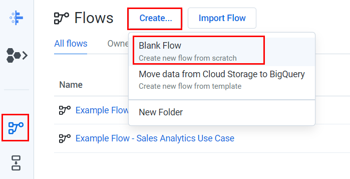
Click on Untitled Flow, then name and describe the flow. Since this lab uses 2016 data from the United States Federal Elections Commission 2016, name the flow "FEC-2016", and then describe the flow as "United States Federal Elections Commission 2016".
Click OK.
The FEC-2016 flow page opens.

Task 4. Import datasets
In this section you import and add data to the FEC-2016 flow.

Click Add Datasets, then select the Import Datasets link.

In the left menu pane, select Cloud Storage to import datasets from Cloud Storage, then click on the pencil to edit the file path.
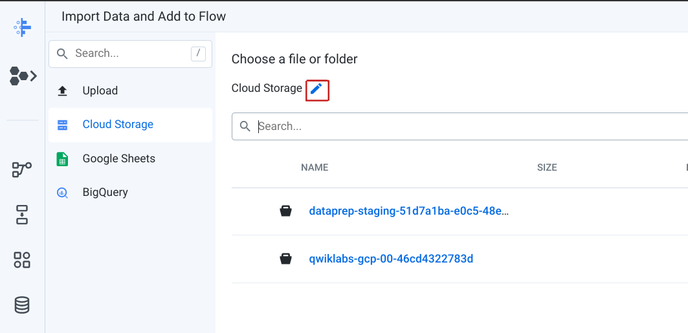
Cloud Storage page

Type gs://spls/gsp105 in the Choose a file or folder text box, then click Go.
You may have to widen the browser window to see the Go and Cancel buttons.

Click us-fec/.

Click the + icon next to cn-2016.txt to create a dataset shown in the right pane. Click on the title in the dataset in the right pane and rename it "Candidate Master 2016".

In the same way add the itcont-2016-orig.txt dataset, and rename it "Campaign Contributions 2016".

Both datasets are listed in the right pane; click Import & Add to Flow.
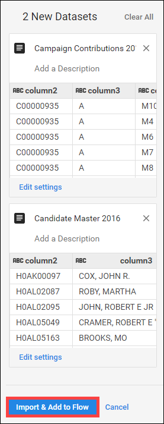
Two datasets listed in the right pane

You see both datasets listed as a flow.

Task 5. Prep the candidate file
By default, the Candidate Master 2016 dataset is selected. In the right pane, click Edit Recipe.
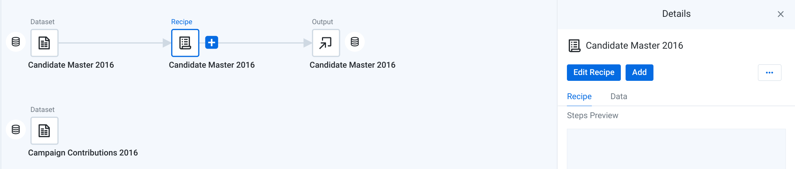
Candidate Master 2016 dataset page

The Candidate Master 2016 Transformer page opens in the grid view.

Candidate Master 2016 Transformer page in grid view
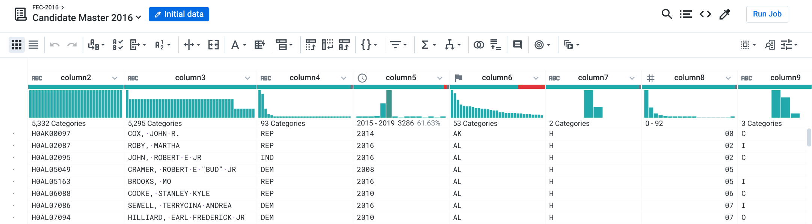

The Transformer page is where you build your transformation recipe and see the results applied to the sample. When you are satisfied with what you see, execute the job against your dataset.

Each of the column heads have a Name and value that specify the data type. To see data types, click the column icon:
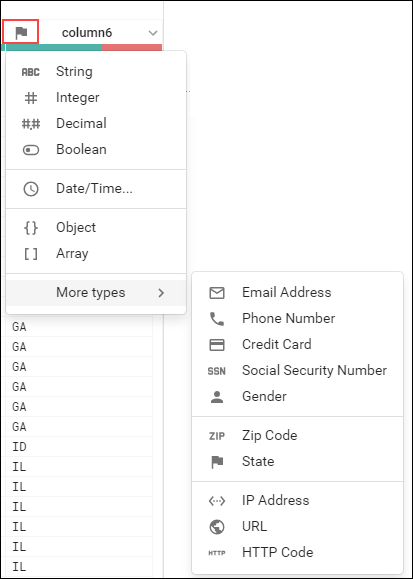

Notice also that when you click the name of the column, a Details panel opens on the right.

Click X in the top right of the Details panel to close the Details panel.

In the following steps you explore data in the grid view and apply transformation steps to your recipe.

Column5 provides data from 1990-2064. Widen column5 (like you would on a spreadsheet) to separate each year. Click to select the tallest bin, which represents the year 2016.
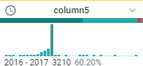

This creates a step where these values are selected.

In the Suggestions panel on the right, in the Keep rows section, click Add to add this step to your recipe.
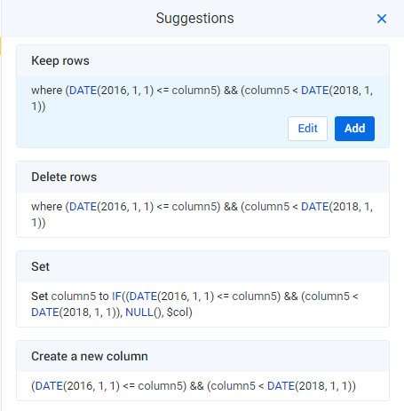
 Suggestions panel

The Recipe panel on the right now has the following step:

Keep rows where(DATE(2016, 1, 1) <= column5) && (column5 < DATE(2018, 1, 1))

In Column6 (State), hover over and click on the mismatched (red) portion of the header to select the mismatched rows.
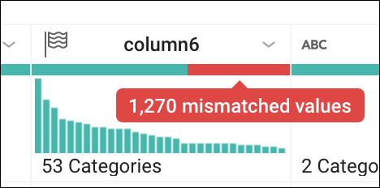
column6

Scroll down to the bottom (highlighted in red) find the mismatched values and notice how most of these records have the value "P" in column7, and "US" in column6. The mismatch occurs because column6 is marked as a "State" column (indicated by the flag icon), but there are non-state (such as "US") values.

To correct the mismatch, click X in the top of the Suggestions panel to cancel the transformation, then click on the flag icon in Column6 and change it to a "String" column.
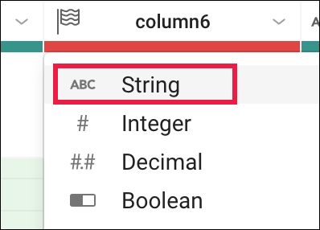
column6

There is no longer a mismatch and the column marker is now green.

Filter on just the presidential candidates, which are those records that have the value "P" in column7. In the histogram for column7, hover over the two bins to see which is "H" and which is "P". Click the "P" bin.
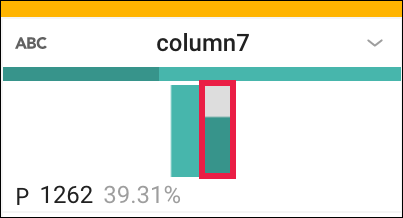
column7

In the right Suggestions panel, click Add to accept the step to the recipe.
Keep rows box

Task 6. Wrangle the Contributions file and join it to the Candidates file
On the Join page, you can add your current dataset to another dataset or recipe based on information that is common to both datasets.

Before you join the Contributions file to the Candidates file, clean up the Contributions file.

Click on FEC-2016 (the dataset selector) at the top of the grid view page.
FEC-2016 at the top of the grid view page
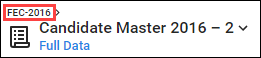
Click to select the grayed out Campaign Contributions 2016.

In the right pane, click Add > Recipe, then click Edit Recipe.

Click the recipe icon at the top right of the page, then click Add New Step.
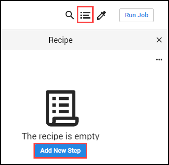
Recipe icon and Add New Step button

Remove extra delimiters in the dataset.

Insert the following Wrangle language command in the Search box:
replacepatterns col: * with: '' on: `{start}"|"{end}` global: true
Copied!
The Transformation Builder parses the Wrangle command and populates the Find and Replace transformation fields.

ransformation Builder

Click Add to add the transform to the recipe.

Add another new step to the recipe. Click New Step, then type "Join" in the Search box.
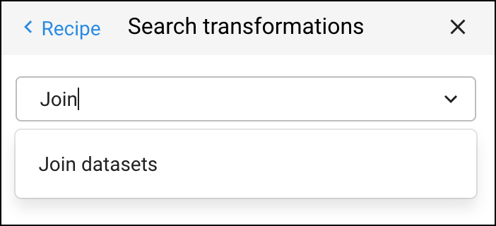
Search transformations box

Click Join datasets to open the Joins page.

Click on "Candidate Master 2016" to join with Campaign Contributions 2016, then Accept in the bottom right.

Candidate Master 2016 row

On the right side, hover in the Join keys section, then click on the pencil (Edit icon).
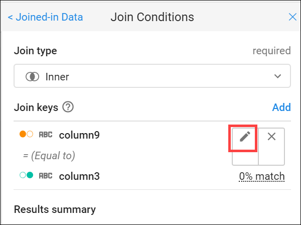
Join conditions box

Dataprep infers common keys. There are many common values that Dataprep suggests as Join Keys.

In the Add Key panel, in the Suggested join keys section, click column2 = column11.
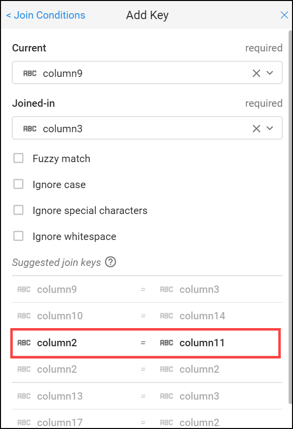
Add Key panel

Click Save and Continue.
Columns 2 and 11 open for your review.

Click Next, then check the checkbox to the left of the "Column" label to add all columns of both datasets to the joined dataset.
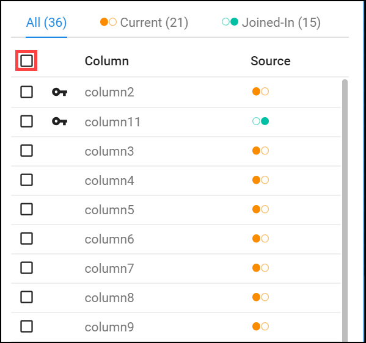
Column label list

Click Review, and then Add to Recipe to return to the grid view.
Task 7. Summary of data
Generate a useful summary by aggregating, averaging, and counting the contributions in Column 16 and grouping the candidates by IDs, names, and party affiliation in Columns 2, 24, 8 respectively.

At the top of the Recipe panel on the right, click on New Step and enter the following formula in the Transformation search box to preview the aggregated data.
pivot value:sum(column16),average(column16),countif(column16 > 0) group: column2,column24,column8
Copied!
An initial sample of the joined and aggregated data is displayed, representing a summary table of US presidential candidates and their 2016 campaign contribution metrics.
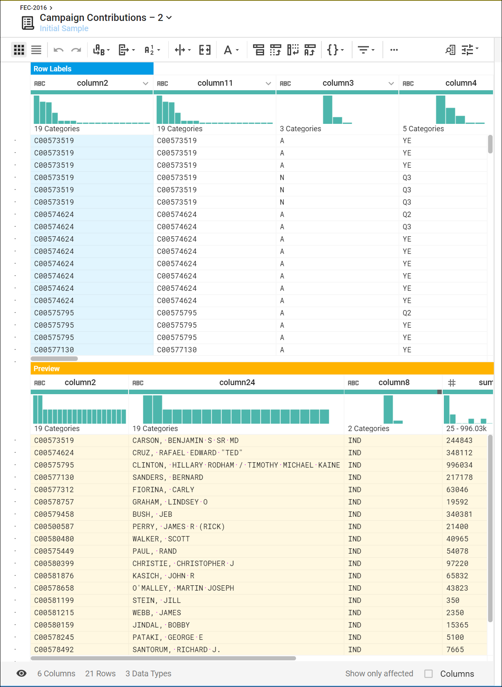

Campaign contributions page

Click Add to open a summary table of major US presidential candidates and their 2016 campaign contribution metrics.
Task 8. Rename columns
You can make the data easier to interpret by renaming the columns.

Add each of the renaming and rounding steps individually to the recipe by clicking New Step, then enter:
rename type: manual mapping: [column24,'Candidate_Name'], [column2,'Candidate_ID'],[column8,'Party_Affiliation'], [sum_column16,'Total_Contribution_Sum'], [average_column16,'Average_Contribution_Sum'], [countif,'Number_of_Contributions']
Copied!
Then click Add.

Add in this last New Step to round the Average Contribution amount:

set col: Average_Contribution_Sum value: round(Average_Contribution_Sum)
Copied!
Then click Add.
Your results look something like this:
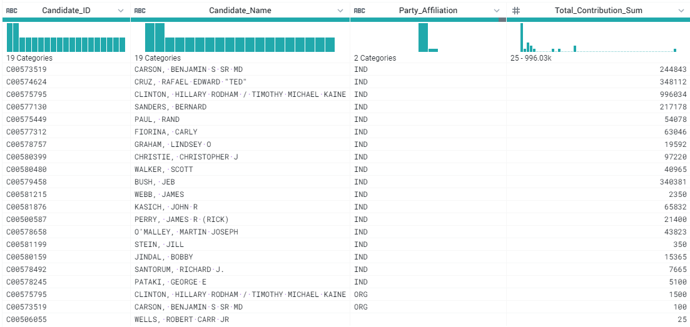

Results table with columns for Candidate_Id, Candidate_Name, Part_Affiliation, and Total_Contribution_Sum

Congratulations!
You used Dataprep to add a dataset and created recipes to wrangle the data into meaningful results.